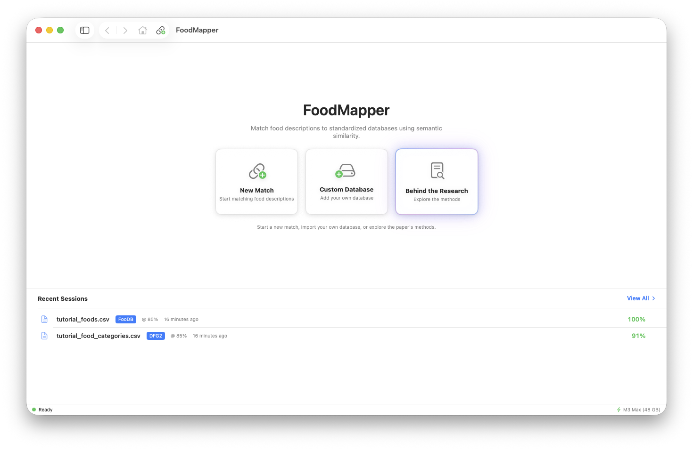
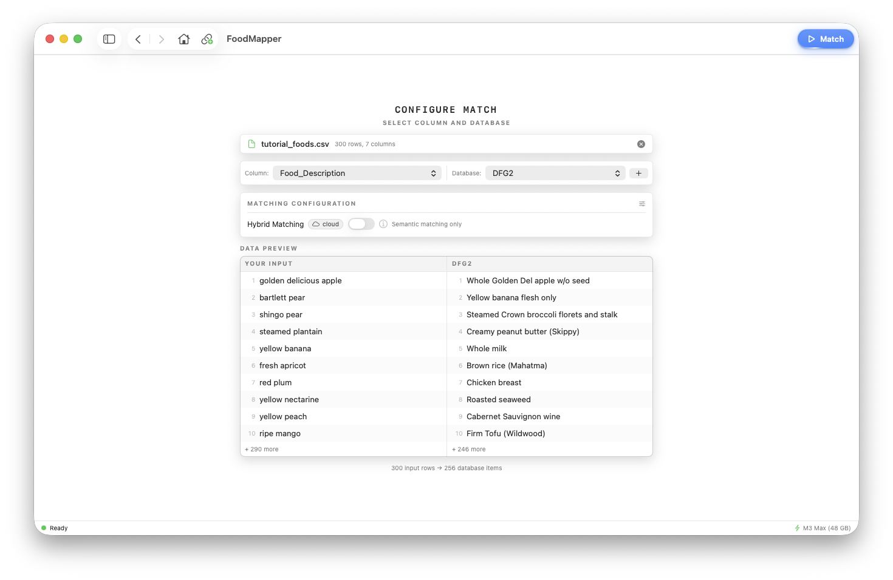
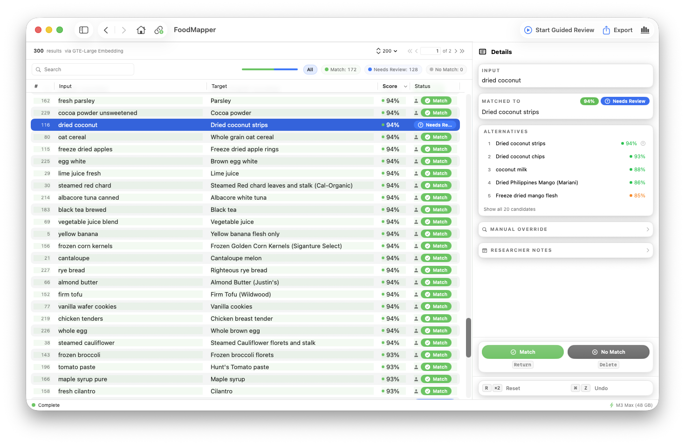
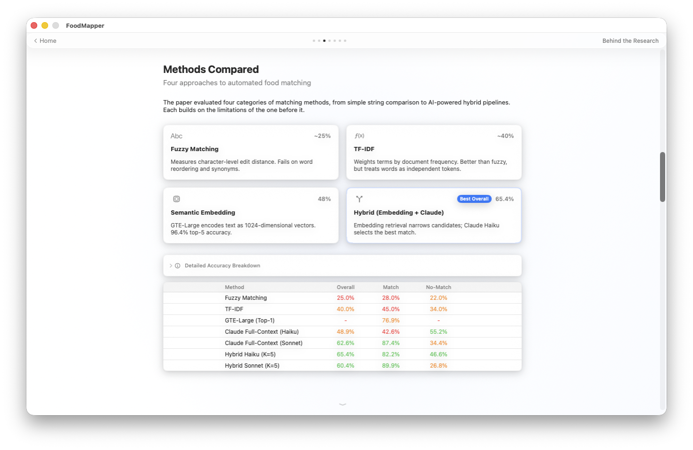

# FoodMapper

Match free-text food descriptions to standardized reference databases using on-device machine learning. Built for nutrition researchers on Apple Silicon.



**[Download FoodMapper](https://github.com/RichardStoker-USDA/FoodMapper/releases/latest/download/FoodMapper.pkg)** -- macOS installer, no admin rights needed.

## What This Is

Nutrition researchers collect food descriptions from study participants through surveys, dietary recalls, and food frequency questionnaires. Those descriptions need to be mapped to standardized database entries before analysis can happen. Manual matching is slow. Keyword matching misses things like "whole wheat bread" matching "whole grain bread." FoodMapper uses embedding models running on your Mac's GPU to handle the matching, then gives you a guided review workflow to verify the results. It's a companion tool to "Evaluation of Large Language Models for Mapping Dietary Data to Food Databases" by USDA ARS researchers.

## Features

- **On-device ML matching** -- Embedding models run entirely on Apple Silicon GPU via MLX. Your data never leaves your Mac.
- **Guided review workflow** -- Auto-advancing review mode with keyboard-driven decisions. Confirm, reject, or override matches, then export.
- **Built-in reference databases** -- FooDB (9,913 food items) and DFG2 (256 commonly consumed foods) ship with the app. Import your own CSV or TSV files too.
- **Session persistence** -- Results and review decisions auto-save. Pick up where you left off.
- **CSV and TSV support** -- Import and export in either format. Delimiter is auto-detected from the file header.
- **Interactive tutorial** -- First-run walkthrough (19 steps) covers the full workflow from loading data through review and export.
- **Behind the Research** -- Interactive showcase walking through the paper's methods, with a live matching demo.
- **In-app updates** -- Automatic update checks via Sparkle. No need to manually check for new versions.
- **Clean CSV/TSV export** -- Original columns plus match metadata (status, score, pipeline, notes). Row order preserved.

## Screenshots







## Getting Started

1. **[Download the installer](https://github.com/RichardStoker-USDA/FoodMapper/releases/latest/download/FoodMapper.pkg)** (PKG, no admin rights needed). A [DMG](https://github.com/RichardStoker-USDA/FoodMapper/releases/latest/download/FoodMapper.dmg) is also available for users who prefer drag-and-drop installation.
2. **Install.** Double-click the PKG to install. No admin rights needed.
3. **Launch.** Search "FoodMapper" in Spotlight (Cmd+Space) or open it from ~/Applications. Download the GTE-Large model when prompted (~640 MB, one-time).
4. **Walk through the tutorial** -- it runs automatically on first launch and covers the full workflow in 19 steps. You can restart it later from the Help menu.
5. **Load a CSV or TSV** with food descriptions. Drag and drop or use the file picker. A template is available on the match setup page if you need to format your data.
6. **Pick your description column**, choose a target database, click Match.
7. **Review results** -- confirm correct matches, fix incorrect ones by selecting a better candidate, add notes, and export when you're done.

## System Requirements

| | |
|---|---|
| **macOS** | 14.0 Sonoma or later |
| **Processor** | Apple Silicon required (M1 or later) |
| **Memory** | 8 GB minimum, 16 GB+ recommended |
| **Disk** | ~640 MB for the default model |

Intel Macs are not supported -- MLX only runs on Apple Silicon.

The app auto-detects your hardware and adjusts batch sizes accordingly. An 8 GB MacBook Air works fine for small-to-medium datasets. Bigger machines process faster and handle larger databases.

## Built-In Databases

**FooDB** -- 9,913 food items from [FooDB.ca](https://foodb.ca/), a database of food chemical constituents maintained by the Wishart Research Group at the University of Alberta. Good for matching specific food descriptions to a broad reference set.

**DFG2** -- 256 food items from the [Davis Food Glycopedia 2.0](https://www.ars.usda.gov/research/publications/publication/?seqNo115=414156), a glycan encyclopedia cataloging carbohydrate structures in commonly consumed foods. Good for mapping food descriptions to molecular-level composition data.

Both come with pre-computed embeddings so matching starts immediately. You can also import your own CSV or TSV as a custom database -- just map the text column and optionally an ID column. Embeddings are computed once on first use and cached.

## How It Works

FoodMapper loads your file, converts each food description into a high-dimensional vector using an on-device embedding model (GTE-Large by default), then finds the closest matches in the target database using cosine similarity. The whole process runs on Apple Silicon GPU through MLX. Nothing is sent to external servers.

For the default embedding-only pipeline, all results above a score floor go to "Needs Review" for you to verify. An optional hybrid pipeline adds a cloud LLM verification stage that can auto-confirm high-confidence matches, reducing the number of items you need to review manually. The hybrid mode requires an Anthropic API key.

## Review Workflow

This is where FoodMapper earns its keep versus a Python script. After matching completes, every result is displayed with its suggested match, similarity score, and alternative candidates in an inspector panel. You can scroll through and review items at your own pace, or switch to guided review mode where the app auto-advances through items flagged as "Needs Review."

For each item, you see the input text, the suggested match, a similarity score, and the top alternative candidates. Press **Return** to confirm a match, **Delete** to reject it, or click an alternative candidate to override. Press **N**/**P** to skip forward or back. Number keys **1-5** select from the candidate list. **R** (pressed twice) resets a decision. **Cmd+Z** undoes.

**Bulk actions:** **Cmd+A** selects all visible rows. Multi-select with **Cmd+Click** (toggle individual), **Shift+Click** (range), or click and drag to select a continuous block. The inspector shows bulk actions when multiple rows are selected: Match All, No Match All, Reset All, and a shared notes field. Filter by category with **Cmd+1** through **Cmd+4** to narrow down what you're working with before selecting.

All decisions save incrementally -- close the app and come back later.

## Export

Results export to CSV or TSV with your original columns intact, plus four metadata columns:

| Column | Content |
|--------|---------|
| `fm_status` | Match, No Match, Needs Review, Match (confirmed), Match (overridden), No Match (confirmed), Match (LLM) |
| `fm_score` | Similarity score (e.g., 0.8723) |
| `fm_pipeline` | Which pipeline produced the match |
| `fm_note` | Your review notes, if any |

All target database columns are appended after the metadata. Overridden rows use the override candidate's data. Row order always matches your original input.

Export from the toolbar (Cmd+E for CSV, Shift+Cmd+E for TSV), or right-click a session in History to export without loading it first.

## Building from Source

```bash
git clone https://github.com/RichardStoker-USDA/FoodMapper.git
cd FoodMapper
xcodebuild -project FoodMapper.xcodeproj -scheme FoodMapper -configuration Release build
```

Requires Xcode 16+ and an Apple Silicon Mac. This is an Xcode project, not Swift Package Manager.

## Privacy

- All matching runs on-device by default. Works completely offline.
- No telemetry, no analytics, no tracking.
- Data stored locally in `~/Library/Application Support/FoodMapper/`.
- **Requires internet for:** automatic update checks (Sparkle) and the optional hybrid verification pipeline, which sends food descriptions to a cloud LLM API (you provide your own key and choose when to use it).

## Research Background

FoodMapper was built to support "Evaluation of Large Language Models for Mapping Dietary Data to Food Databases," a study on using LLMs and embedding models to match dietary data to food composition databases. The app includes a "Behind the Research" interactive showcase that walks through the paper's methods -- from the problem of free-text food matching, through embedding-based semantic search, to LLM-assisted verification. You can run the paper's exact pipeline against the DFG2 dataset right in the showcase.

The benchmark datasets, experiments, and analysis code from the research are available at [dglemay/USDA-Food-Mapping](https://github.com/dglemay/USDA-Food-Mapping).

Built by researchers at the USDA Agricultural Research Service, Western Human Nutrition Research Center in Davis, California.

## License

CC0 1.0 Universal -- Public Domain Dedication.

This software was prepared by employees of the United States Government as part of their official duties. Under 17 U.S.C. 105, no copyright protection is available for such works under U.S. law. You can copy, modify, distribute, and use this work without restriction.

See [LICENSE](LICENSE) for full text and third-party dependency licenses.

## Authors

D.G. Lemay, M.P. Strohmeier, R.B. Stoker, J.A. Larke, S.M.G. Wilson

Western Human Nutrition Research Center, Diet Microbiome and Immunity Research Unit
USDA Agricultural Research Service, Davis, California
