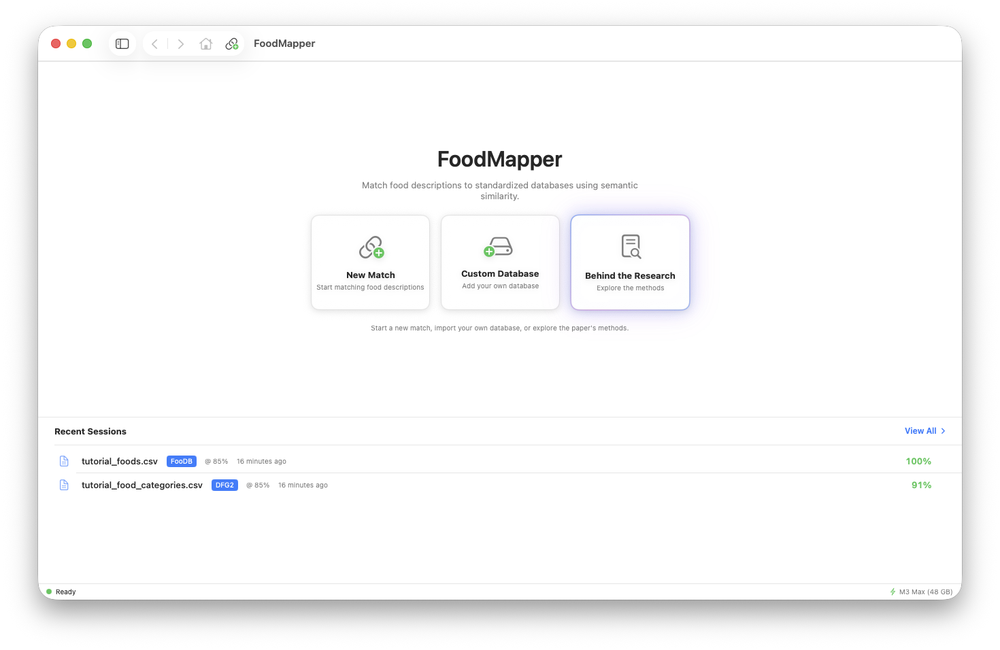
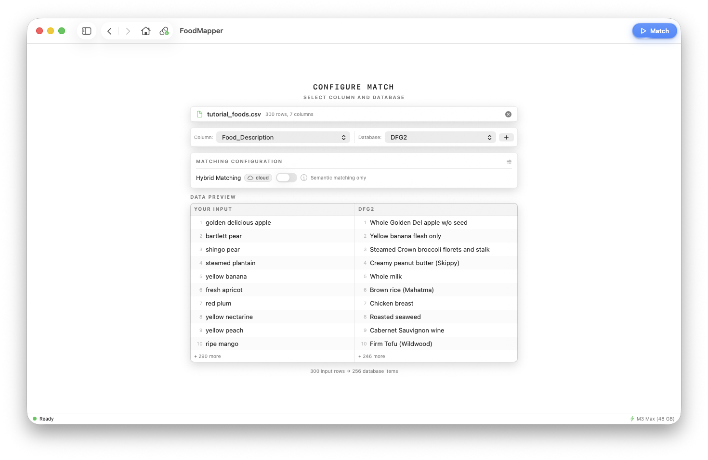
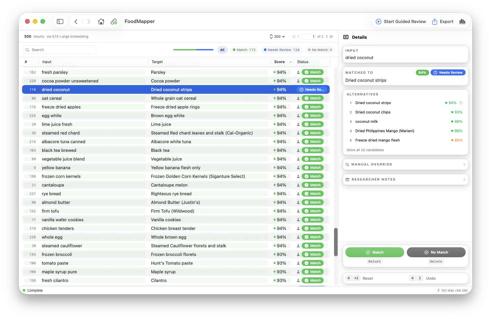
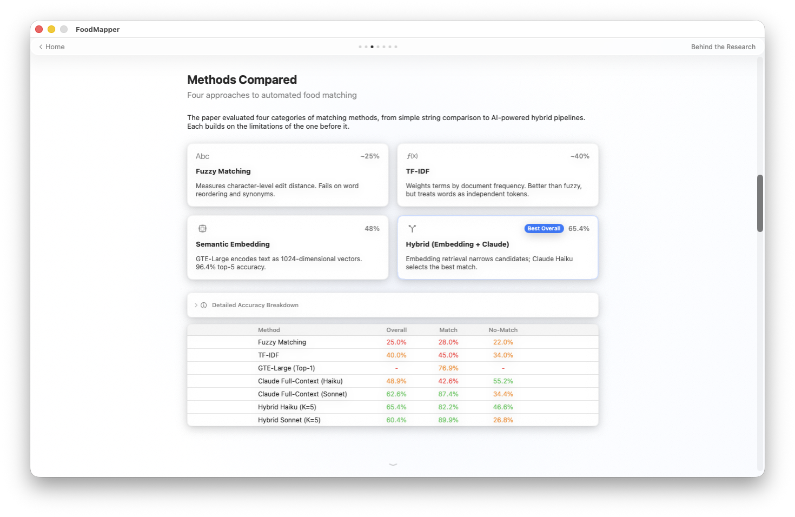

# FoodMapper

Match free-text food descriptions to standardized reference databases using on-device machine learning. Built for nutrition researchers on Apple Silicon.



**[Download FoodMapper](https://github.com/RichardStoker-USDA/FoodMapper/releases/latest/download/FoodMapper.pkg)**

## What This Is

Nutrition researchers collect food descriptions from study participants through surveys, dietary recalls, and food frequency questionnaires. Those descriptions need to be mapped to standardized database entries before analysis can happen. Manual matching is slow. Keyword matching misses things like "whole wheat bread" matching "whole grain bread." FoodMapper uses the default GTE-Large embedding path on your Mac's GPU, then gives you a guided review workflow to verify the results. It's a companion tool to ["Evaluation of Large Language Models for Mapping Dietary Data to Food Databases"](https://doi.org/10.1016/j.tjnut.2026.101678) by USDA ARS researchers.

## Features

- **On-device matching:** The default GTE-Large embedding path runs through MLX on Apple Silicon. Input and target data stay on the Mac for that path.
- **Guided review:** Confirm, reject, or override results with keyboard shortcuts or Guided Review, then export.
- **Built-in reference databases:** FooDB (9,913 food items) and DFG2 (256 commonly consumed foods) ship with the app. You can also import a CSV or TSV target database.
- **Saved sessions:** Results and review decisions save as you work. A History export restores original input columns when the stored input file is still available and readable. Bulk History exports contain saved mapping rows.
- **CSV and TSV support:** Import and export either format. FoodMapper detects the delimiter from the file header.
- **Interactive tutorial:** The first-run walkthrough covers data loading, matching, review, and export.
- **Behind the Research:** The in-app section explains the paper's methods and includes a matching demonstration.
- **In-app updates:** FoodMapper can check for updates automatically. You can also select FoodMapper > Check for Updates.
- **CSV/TSV export:** A current-session export includes original columns when the input remains available, plus match metadata.

## Screenshots







## Getting Started

1. **[Download FoodMapper](https://github.com/RichardStoker-USDA/FoodMapper/releases/latest/download/FoodMapper.pkg)**. A [DMG](https://github.com/RichardStoker-USDA/FoodMapper/releases/latest/download/FoodMapper.dmg) is also available for drag-and-drop installation.
2. **Install.** Open the PKG and follow the installer.
3. **Launch.** Search "FoodMapper" in Spotlight (Cmd+Space) or open it from ~/Applications. Download the GTE-Large model when prompted (~640 MiB, one-time).
4. **Walk through the tutorial.** It runs automatically on first launch. You can restart it later from the Help menu.
5. **Load a CSV or TSV** with food descriptions. Drag and drop or use the file picker. A template is available on the match setup page if you need to format your data.
6. **Pick your description column**, choose a target database, click Match.
7. **Review results.** Confirm correct matches, select another retained candidate when needed, add notes, and export.

## System Requirements

| | |
|---|---|
| **macOS** | 14.0 Sonoma or later |
| **Processor** | Apple Silicon required (M1 or later) |
| **Memory** | Depends on the selected model, target database, and active workload |
| **Disk** | ~640 MiB for the default model |

Intel Macs are not supported because MLX requires Apple Silicon.

The app adjusts batch sizes for the detected hardware. Runtime and memory use depend on the input, target database, and Mac configuration.

## Built-In Databases

**FooDB:** 9,913 food items from [FooDB.ca](https://foodb.ca/), maintained by the Wishart Research Group at the University of Alberta.

**DFG2:** 256 food items from the [Davis Food Glycopedia 2.0](https://www.ars.usda.gov/research/publications/publication/?seqNo115=414156), a glycan encyclopedia of commonly consumed foods.

Both databases include their source rows in the app. After you approve the GTE-Large download, FoodMapper computes and caches embeddings the first time you match against a database. For a custom CSV or TSV target, select the text column and an optional ID column during import.

## How It Works

FoodMapper converts each food description into an embedding with GTE-Large by default, then compares it with candidate database entries by cosine similarity. The default local path runs through MLX on Apple Silicon. If you configure and select the optional Anthropic path, FoodMapper sends the input descriptions and candidate entries needed for that verification run to Anthropic.

For default embedding matching, a fixed 0.50 eligibility floor determines whether the leading retrieval becomes the selected target. The floor does not remove retrieved candidate database entries from the review list. The separate Smart Auto-Match floor and score gap can mark a selected GTE-Large result for review or match. The optional Anthropic path requires an Anthropic API key.

## Review Workflow

FoodMapper adds a review workflow that a batch script does not provide. After matching completes, the inspector shows a selected target and score when available, plus retrieved candidate database entries when the session stored them. You can review at your own pace or use guided review for items flagged as "Needs Review."

For each item, you see the input text, a selected target when one is available, a score when one is available, and retrieved candidate database entries when the session stored them. Press **Return** to confirm a match, **Delete** to reject it, or click an alternative candidate to override. Press **N**/**P** to skip forward or back. Number keys **1-5** select from the candidate list. **R** (pressed twice) resets a decision. **Cmd+Z** undoes.

Manual Override searches the deduplicated union of candidate database entries retained for the current session. It does not search the full target database.

**Bulk actions:** **Cmd+A** selects all visible rows. Multi-select with **Cmd+Click** (toggle individual), **Shift+Click** (range), or click and drag to select a continuous block. The inspector shows bulk actions when multiple rows are selected: Match All, No Match All, Reset All, and a shared notes field. Filter by category with **Cmd+1** through **Cmd+4** to narrow down what you're working with before selecting.

Decisions save as you work, so you can close the app and continue later.

## Export

A current session export includes original input columns when that input remains loaded. A single-session History export can do the same only when its stored input file is available and readable. Otherwise, FoodMapper exports saved mapping rows and metadata.

| Column | Content |
|--------|---------|
| `fm_status` | Match, No Match, Needs Review, Match (confirmed), Match (overridden), No Match (confirmed), Match (LLM) |
| `fm_score` | Score when available (e.g., 0.8723) |
| `fm_pipeline` | Pipeline label when stored |
| `fm_note` | Your review notes, if any |

Target columns are included when target metadata is stored. For targets with unique configured IDs, an override's extra fields come from its retained candidate row. Bulk History exports use reduced saved mapping rows and do not restore original input columns.

Export from the toolbar (Cmd+E for CSV, Shift+Cmd+E for TSV), or right-click a session in History to export without loading it first.

## Building from Source

```bash
git clone https://github.com/RichardStoker-USDA/FoodMapper.git
cd FoodMapper
xcodebuild -project FoodMapper.xcodeproj -scheme FoodMapper -configuration Release build
```

Requires stable Xcode 26.6 or later and an Apple Silicon Mac. This is an Xcode project, not a standalone Swift package.

## Privacy

- Default local matching works offline after GTE-Large is installed.
- No telemetry, no analytics, no tracking.
- Data stored locally in `~/Library/Application Support/FoodMapper/`.
- Optional Anthropic API keys are stored in the macOS Keychain.
- **Requires internet for:** user-approved model downloads, automatic update checks (Sparkle), and the optional Anthropic verification path, which sends the input descriptions and candidate matches needed for verification after you provide your own key and select it.

## Research Background

FoodMapper was built to support ["Evaluation of Large Language Models for Mapping Dietary Data to Food Databases"](https://doi.org/10.1016/j.tjnut.2026.101678), which evaluated fuzzy matching, TF-IDF, embeddings, and language-model-assisted matching. The study includes an ASA24-to-FooDB task and an NHANES-to-DFG2 task. The NHANES-to-DFG2 task includes descriptions with no valid DFG2 match. The in-app research section explains the methods and includes an NHANES-to-DFG2 demonstration.

The benchmark datasets, experiments, and analysis code from the research are available at [dglemay/USDA-Food-Mapping](https://github.com/dglemay/USDA-Food-Mapping).

**Citation:** Lemay DG, Strohmeier MP, Stoker RB, Larke JA, Wilson SMG. Evaluation of Large Language Models for Mapping Dietary Data to Food Databases. *J Nutr.* 2026 Aug;156(8):101678. [doi:10.1016/j.tjnut.2026.101678](https://doi.org/10.1016/j.tjnut.2026.101678). [PMID: 42309308](https://pubmed.ncbi.nlm.nih.gov/42309308/).

Built by researchers at the USDA Agricultural Research Service, Western Human Nutrition Research Center in Davis, California.

## License

CC0 1.0 Universal Public Domain Dedication.

This software was prepared by employees of the United States Government as part of their official duties. Under 17 U.S.C. 105, no copyright protection is available for those works under U.S. law. Bundled third-party data and libraries retain their own terms.

See [LICENSE](LICENSE) and [THIRD_PARTY_NOTICES](THIRD_PARTY_NOTICES) for source and license details.

## Authors

D.G. Lemay, M.P. Strohmeier, R.B. Stoker, J.A. Larke, S.M.G. Wilson

Western Human Nutrition Research Center, Diet Microbiome and Immunity Research Unit
USDA Agricultural Research Service, Davis, California
